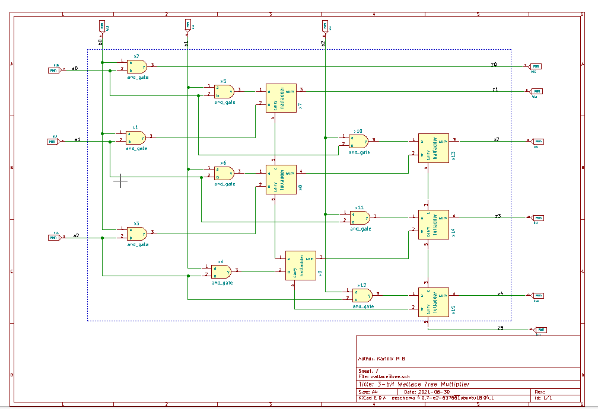
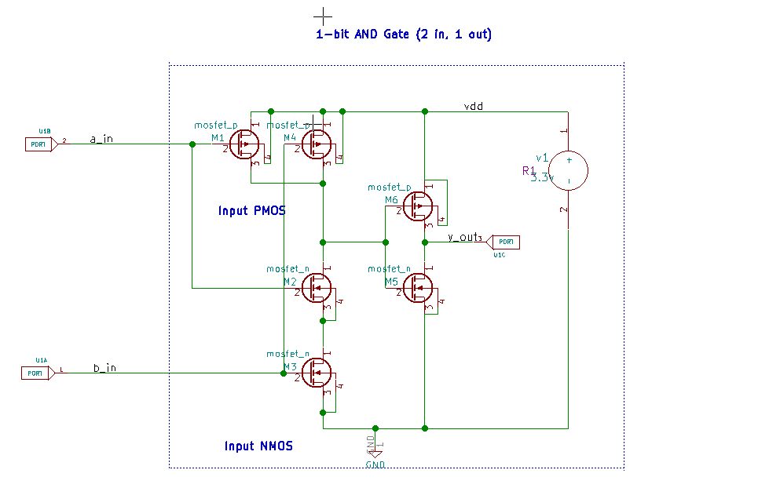
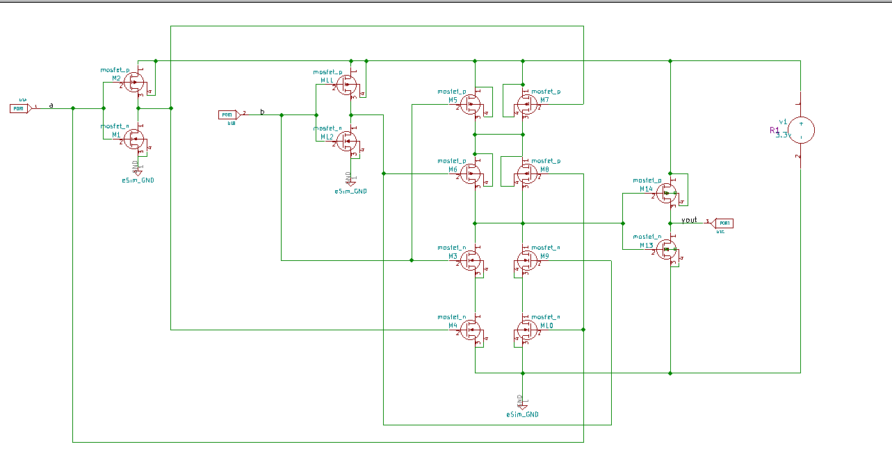
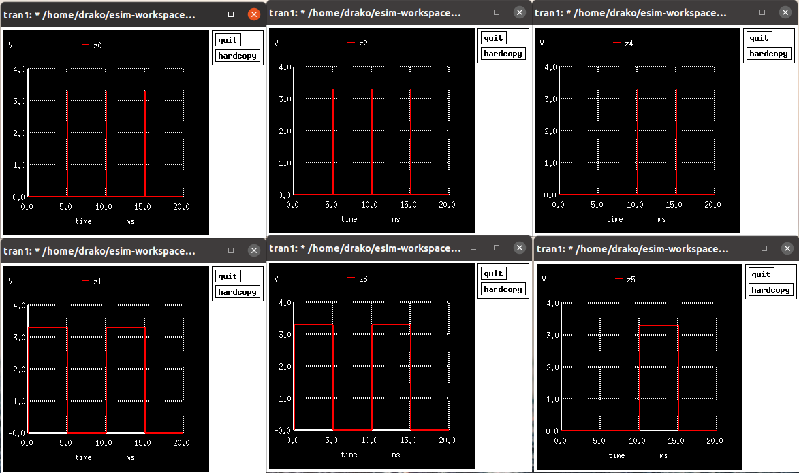

# Implementation of a CMOS 3-bit Wallace Tree Multiplier using SKY130 PDK with eSim



A Wallace multiplier is a digital circuit which multiplies two
integers in binary format. It uses half and full adders to sum 
partial products in stages until two numbers are left. In this
project I shall be developing a 3-bit multiplier using Wallace 
tree reduction. Before you go through this make you have the 
sky130pdk in this folder and change the current path in 
"wallace3tree_test.cir" directing to the sky130 pdk.

## Requirements: 

* NGSpice Software
* eSim 

## Recreate This Project:

You can download this repository by

```sh
git clone https://github.com/Ikarthikmb/wallace-tree.git
cd wallace-tree
```
Open eSim application and select **open project** then navigate to this folder(wallace-tree)
 and select **wallace3tree**. The **wallace-tree** project file is now added.

## Ports of CMOS 3-bit Wallace Multiplier:

Port | Type | Description
--- | --- | ---
a | Input | 3-bit input 
b | Input | 3-bit input 
z | Output | 6-bit output

Here "a" and "b" are 3-bit input digits, and the output "z"
contains 6-bits.

## Components of 3-bit Wallace Tree Multiplier:

Component | Total
--- | ---
AND gates | 9 nos  
Half Adders | 3 nos  
Full Adders | 3 nos  

## Sub-Circuits:

1. halfadder
2. fulladder
3. and_gate
4. xor_gate

## Run:

Run the simulation in terminal by

```ngspice wallace3tree_test.cir```

## Schematics:

You can view the schematic using **esim** software, launch esim and 
open this folder, the esim automatically detects the `.proj` file 
and creats a project for "**wallace3tree**". Then select 
"**wallace3tree.sch**" to launch the schematic of the project.

3-bit Wallace tree Multiplier Schematic:


AND gate schematic:



XOR gate schematic:




## Figures

Output waveform(z5z4z3z2z1z0):


