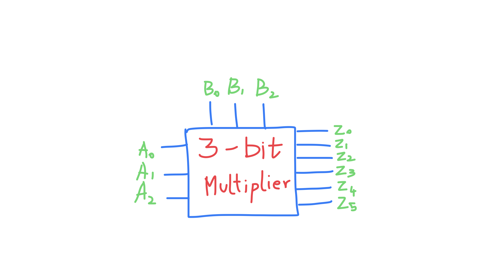

# Implementation of a CMOS 3-bit Wallace Tree Multiplier using SKY130 PDK with eSim


A Wallace multiplier is a digital circuit which multiplies two
integers in binary format. It uses half and full adders to sum 
partial products in stages until two numbers are left. In this
project I shall be developing a 3-bit multiplier using Wallace 
tree reduction. Before you go through this make you have the 
sky130pdk in this folder and change the current path in 
"wallace3tree_test.cir" directing to the sky130 pdk.

## Requirements: 

* NGSpice Software
* eSim 

## Recreate This Project:

You can download this repository by

```sh
git clone https://github.com/Ikarthikmb/wallace-tree.git
cd wallace-tree
```
Open eSim application and select **open project** then navigate to this folder(wallace-tree)
 and select **wallace3tree**. The **wallace-tree** project file is now added in the eSim.

## Ports of CMOS 3-bit Wallace Multiplier:



Port | Type | Description
--- | --- | ---
a | Input | 3-bit input 
b | Input | 3-bit input 
z | Output | 6-bit output

Here "a" and "b" are 3-bit input digits, and the output "z"
contains 6-bits.

## Components of 3-bit Wallace Tree Multiplier:

Component | Total
--- | ---
AND gates | 9 nos  
Half Adders | 3 nos  
Full Adders | 3 nos  

## Sub-Circuits:

1. halfadder
2. fulladder
3. and_gate
4. xor_gate

## Wallace Tree Algorithm: 


It has three steps:

1. Multiply each bit of one of the arguments, by each bit of the other.
2. Reduce the number of partial products to two by layers of full and half adders. 
3. Group the wires in two numbers, and add them with a conventional adder.

### 3 bit Reduction algorithm


## Schematics:

You can view the schematic using **esim** software, launch esim and 
open this folder, the esim automatically detects the `.proj` file 
and creats a project for "**wallace3tree**". Then select respective 
"**.sch**" file to launch the schematic of the project.

## AND GATE


### AND gate schematic:


## XOR GATE


### XOR gate schematic:


## HALF ADDER


### Half Adder schematic:


## FULL ADDER


### Full Adder schematic:


##  3-bit Wallace Tree Multiplier schematic:


## Simulation:

Open terminal, change the directory to wallace3tree.Run the simulation by

```
ngspice wallace3tree_test.cir
```


## Figures

Output waveform(z5z4z3z2z1z0):


## References: 

* Wallace Tree: https://en.wikipedia.org/wiki/Wallace_tree

* Binary Multiplier: https://en.wikipedia.org/wiki/Binary_multiplier?wprov=sfti1

* Chris Wallace: https://en.wikipedia.org/wiki/Chris_Wallace_(computer_scientist)?wprov=sfti1

* eSim EDA tool: https://esim.fossee.in


