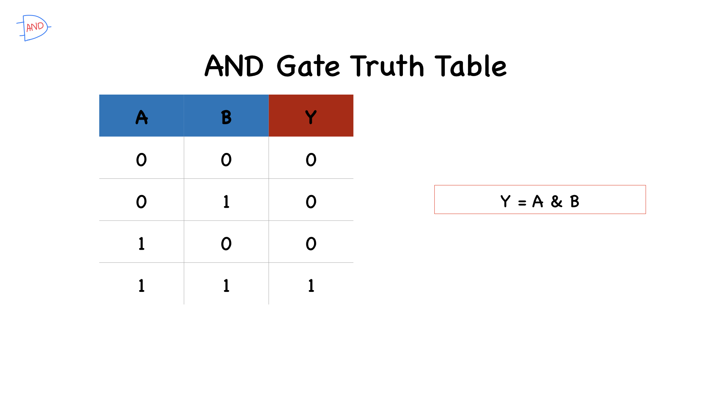

# Implementation of a CMOS 3-bit Wallace Tree Multiplier using SKY130 PDK with eSim

A Wallace multiplier is a digital circuit which multiplies two
integers in binary format. It uses half and full adders to sum 
partial products in stages until two numbers are left. In this
project I shall be developing a 3-bit multiplier using Wallace 
tree reduction. Before you go through this make you have the 
sky130pdk in this folder and change the current path in 
"wallace3tree_test.cir" directing to the sky130 pdk.

## Requirements: 

* NGSpice Software
* eSim 

## Ports of CMOS 3-bit Wallace Multiplier:

<<<<<<< HEAD


Port | Type | Description
--- | --- | ---
a | Input | 3-bit input 
b | Input | 3-bit input 
z | Output | 6-bit output
=======
Port  | Description
---  | ---
a  | 3-bit input 
b  | 3-bit input 
z  | 6-bit output
>>>>>>> 22a6a2754b128722f7451292b9f76703429d4d92

Here "a" and "b" are 3-bit input digits, and the output "z"
contains 6-bits.

## Components of 3-bit Wallace Tree Multiplier:

Component | Total
--- | ---
AND gates | 9 nos  
Half Adders | 3 nos  
Full Adders | 3 nos  

## Sub-Circuits:

1. halfadder
2. fulladder
3. and_gate
4. xor_gate

<<<<<<< HEAD
## Wallace Tree Algorithm: 


It has three steps:

1. Multiply each bit of one of the arguments, by each bit of the other.
2. Reduce the number of partial products to two by layers of full and half adders. 
3. Group the wires in two numbers, and add them with a conventional adder.

### 3 bit Reduction algorithm


## Schematics:

You can view the schematic using **esim** software, launch esim and 
open this folder, the esim automatically detects the `.proj` file 
and creats a project for "**wallace3tree**". Then select respective 
"**.sch**" file to launch the schematic of the project.

## AND GATE



### AND gate schematic:


## XOR GATE


### XOR gate schematic:


## HALF ADDER


### Half Adder schematic:


=======
## Steps To Run Project:

**Step-1:** Download this repository

```sh
$ git clone https://github.com/Ikarthikmb/wallace-tree.git
```

**Step-2:** Creating eSim Project

Open eSim application and select **open project** then navigate to folder `wallace-tree`
 to select **wallace3tree**. The **wallace3tree** project file is now added in the eSim.

**Step-3:** Schematic for AND gate
>>>>>>> 22a6a2754b128722f7451292b9f76703429d4d92

## FULL ADDER

<<<<<<< HEAD

=======
Draw a schematic with eSim Schematic editor for an **AND gate** logic circuit with cmos logic, 
perform CRC error check and export the **ngspice netlist**.

**Step-4:** Schematic for XOR gate
>>>>>>> 22a6a2754b128722f7451292b9f76703429d4d92

### Full Adder schematic:

<<<<<<< HEAD


##  3-bit Wallace Tree Multiplier schematic:


## Simulation:

Open terminal, change the directory to wallace3tree.Run the simulation by

```
ngspice wallace3tree_test.cir
```
=======
Draw a schematic with eSim Schematic editor for an **XOR gate** logic circuit with cmos logic, 
perform CRC error check and export the **ngspice netlist**.

**Step-5:** Schematic for Half Adder

Draw a schematic with eSim Schematic editor for an **Half Adder** circuit with AND and XOR gates, 
then perform CRC error check and export the **ngspice netlist**.

**Step-6:** Schematic for Full Adder

Draw a schematic with eSim Schematic editor for a **Full Adder** circuit with AND and XOR gates, 
then perform CRC error check and export the **ngspice netlist**.

**Step-7:** Schematic for 3-bit Wallace tree Multiplier


>>>>>>> 22a6a2754b128722f7451292b9f76703429d4d92

Draw a schematic with eSim Schematic editor for a **3-bit Wallace Multiplier** logic circuit 
with AND gates, half adders and full adders. Then perform CRC error check and export the **ngspice netlist**.

**Step-8:** Convert KiCAD to NGSpice

After the netlist is generated, select **kicad to spice** from the eSim window to convert the 
kicad schematic to ngspice model. Rename the netlist file `wallace3tree.cir.out` to `wallace3tree_test.cir`

```sh
$ cp wallace3tree.cir.out wallace3tree.cir
```

**Step-9:** Adding SKY130 Tech

Add the path for the sky130pdk in the `wallace3tree.cir.out` file. In the subcircuit `.sub` file replace the 
model mosfet_n with `sky130_fd_pr__nfet_01v8` and mosfet_p with `sky130_fd_pr__pfet_01v8`. 
Now, lets simulate the circuit with ngspice.


**Step-10:** NGSpice Simulation
Lets assign the inputs `a` and `b` with the pulse signals and try to observe the output.

```sh
$ ngspice wallace3tree_test.cir
```
If you encounter with errors recheck the circuit and perform the `run` again.

### Figures

Output waveform(z5z4z3z2z1z0):


<<<<<<< HEAD

## References: 

* Wallace Tree: https://en.wikipedia.org/wiki/Wallace_tree

* Binary Multiplier: https://en.wikipedia.org/wiki/Binary_multiplier?wprov=sfti1

* Chris Wallace: https://en.wikipedia.org/wiki/Chris_Wallace_(computer_scientist)?wprov=sfti1

* eSim EDA tool: https://esim.fossee.in

=======
## References:

* https://en.wikipedia.org/wiki/Wallace_tree

---
This is a project submitted to [eSim marathon](https://hackathon.fossee.in/esim/) partnered with
 [Free/Libre and Open Source Software for Education(fossee)](https://fossee.in/about), 
 [Indian Institute of Technology, Bombay(IITB)](https://www.iitb.ac.in/),
 [VLSI System Design(VSD)](https://www.vlsisystemdesign.com/about-us/) and 
[Ministry of Education, India](https://www.education.gov.in/en) during May-June of 2021.
>>>>>>> 22a6a2754b128722f7451292b9f76703429d4d92

